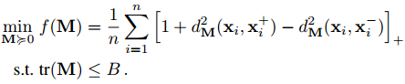
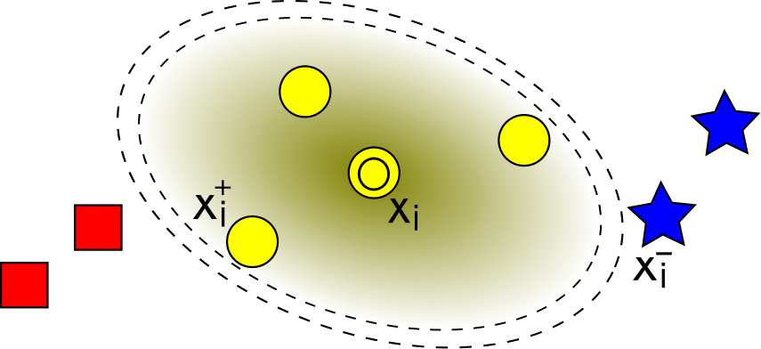
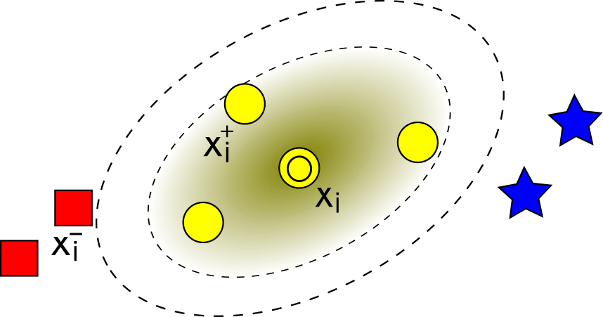

# LMDML
Scalable large-margin distance metric learning using stochastic gradient descent

LMDML contains the implementation of Large-Margin Distance Metric Learning using stochastic gradient descent.
For any question, please contact Bac Nguyen (Bac.NguyenCong@ugent.be).

**How to learn a distance metric?**



 

## Abstract
The key to success of many machine learning and pattern recognition algorithms is the way of computing distances between the input data. In this paper, we propose a large-margin-based approach, named Large-Margin Distance Metric Learning (LMDML), for learning a  Mahalanobis distance metric. LMDML employs the principle of margin maximization to learn the distance metric with the goal of improving $k$-nearest-neighbor (\mbox{$k$-NN}) classification. The main challenge of distance metric learning is the positive semidefiniteness constraint on the Mahalanobis matrix. Semidefinite programming is commonly used to enforce this constraint, but it becomes computationally intractable on large-scale data sets. To overcome this limitation, we develop an efficient algorithm based on stochastic gradient descent (SGD). Our algorithm can avoid the computations of the full gradient and ensure that the learned matrix remains within the positive semidefinite (PSD) cone after each iteration. Extensive experiments show that the proposed algorithm is scalable to large data sets and  outperforms other state-of-the-art distance metric learning approaches regarding classification accuracy and training time.

### Prerequisites
This has been tested using MATLAB 2010A and later on Windows and Linux (Mac should be fine).

### Installation
Download the folder "LMDML" into the directory of your choice. Then within MATLAB go to file >> Set path... and add the directory containing "LMDML" to the list (if it isn't already). That's it.

### Usage

Please run (inside the matlab console)
```matlab
demo  % demo of LMDML
```

## Authors

* [Bac Nguyen Cong](https://github.com/bacnguyencong)

## Acknowledgments
If you find this code useful in your research, please consider citing:
``` bibtex
@Article{Nguyen2019a,
  Title       = {Scalable large-margin distance metric learning using stochastic gradient descent},
  Author      = {Bac Nguyen and Carlos Morell and De Baets, Bernard},
  Journal     = {IEEE Transactions on Cybernetics},
  Year        = {2018},
  doi         = {https://doi.org/10.1109/TCYB.2018.2881417}
}
```


